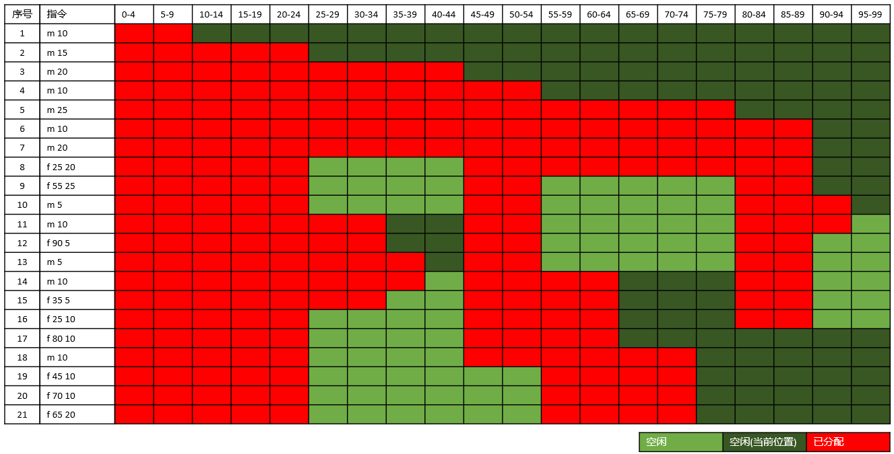

# Lab01 Memory Management
| 指令序号 | 指令内容 | 指令含义                         |
| -------- | -------- | -------------------------------- |
| 1        | m 10     | 测试单块内存分配可靠性           |
| 2        | m 15     | 测试单块内存分配可靠性           |
| 3        | m 20     | 测试单块内存分配可靠性           |
| 4        | m 10     | 测试单块内存分配可靠性           |
| 5        | m 25     | 测试单块内存分配可靠性           |
| 6        | m 10     | 测试单块内存分配可靠性           |
| 7        | m 20     | 测试分配内存超出空闲内存异常     |
| 8        | f 25 20  | 测试释放内存中常规第一种情况     |
| 9        | f 55 25  | 测试释放内存中常规第一种情况     |
| 10       | m 5      | 测试分配内存的“循环首次”功能     |
| 11       | m 10     | 测试分配内存的“循环首次”功能     |
| 12       | f 90 5   | 测试释放内存中常规第三种情况     |
| 13       | m 5      | 测试分配内存的“循环首次”功能     |
| 14       | m 10     | 测试分配内存的“循环首次”功能     |
| 15       | f 35 5   | 测试释放内存中常规第三种情况     |
| 16       | f 25 10  | 测试释放内存中常规第三种情况     |
| 17       | f 80 10  | 测试释放内存中常规第四种情况     |
| 18       | m 10     | 测试分配内存的“循环首次”功能     |
| 19       | f 45 10  | 用于测试释放内存中常规第二种情况 |
| 20       | f 70 10  | 测试释放内存中异常情况           |
| 21       | f 65 20  | 测试释放内存中异常情况           |

